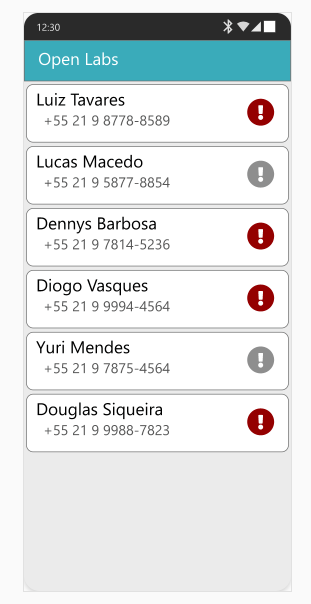
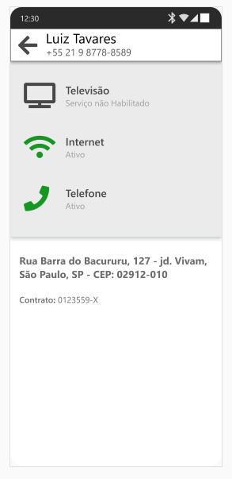

# Open Labs Mobile Teste 

Na open Labs P&D trabalhamos com diversas plataformas, como: web, web service, android e IOS.  Essa é uma simulação de um de nossos produtos. 
Neste teste você irá consumir um um json local, para personalizar as telas da aplicação.

[JSON de exemplo para consumir](json/index.json)

# Lista de clientes
Na primeira tela será exibido uma lista com os clientes, possuindo em cada item: Nome, telefone e um ícone de aviso, que deve ser da cor vermelho caso o cliente seja especial e cinza caso contrário. O usuário deverá clicar em um determinado cliente, navegando para a tela de detalhes.

# Detalhes do cliente

Na segunda tela é demonstrado  os detalhes do cliente selecionado. Como, informações dos serviços que ele possui, nome, status, endereço e o código do seu contrato. O usuário também tem a opção de voltar para tela inicial.

## Telas

## Cliente

 

## Detalhes

